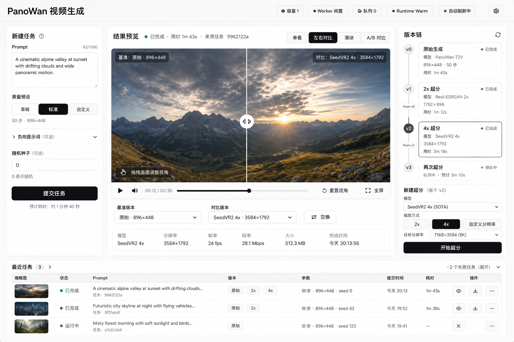

# PanoWan Video Workspace Design Brief

Status: Draft for confirmation
Date: 2026-05-03
Reference mockup: [panowan-video-workspace-reference.png](../assets/panowan-video-workspace-reference.png)

## 1. Feature Summary

Reframe the PanoWan frontend from a task-list-first generation form into a video workspace centered on generated outputs. The page should help a local operator submit a panorama generation, inspect the latest result, drag the panorama viewpoint, create one or more upscale versions, and compare versions without leaving the main working surface.

The implementation should remain grounded in the existing single-page product and current backend capabilities. The goal is not a marketing redesign; it is a denser, clearer operating UI for generation, preview, upscaling, and comparison.

## 2. Primary User Action

The primary action is to evaluate and improve the latest generated video result.

Submitting a prompt is important, but it is the entry point. Once a result exists, the interface should prioritize preview, viewpoint control, version selection, and upscale comparison over the historical job list.

## 3. Design Direction

Use the project's existing `DESIGN.md` direction: grayscale, minimal, white canvas, Cal Sans-style headings, Inter-style body text, and subtle multi-layer shadows. Color should be limited to semantic states such as success, failure, active running, and focus.

The product should feel like a compact creative operations console: calm, precise, and result-focused. Avoid decorative gradients, warm brand color, large hero sections, card-heavy marketing composition, or visually loud workflow diagrams.

The memorable interaction should be the central panorama result stage: a large preview where the user can drag the viewpoint and immediately compare original and upscaled versions.

## 4. Layout Strategy

Use a single-page workspace with a compact top status bar and three main working zones.

Top status bar:

- Left: product title.
- Right: capacity, worker status, queue count, runtime state, refresh state, settings.
- The status bar should be informative but visually quiet. It should not become the main interaction surface.

Left task rail:

- Contains prompt input, quality presets, optional negative prompt, seed, and submit action.
- Keep it narrow and compact. It should be usable but not compete with the result preview.
- Advanced fields should use progressive disclosure.

Center result stage:

- The dominant visual area.
- Shows the selected video result as an interactive panorama preview.
- Supports single view, side-by-side comparison, slider comparison, and A/B comparison.
- Contains playback controls, viewpoint controls, version quick switcher, and current result metadata.

Right version and upscale rail:

- Shows the selected result's version chain rather than independent jobs.
- Original generation and each upscale are displayed as related versions.
- The selected version controls the center preview.
- Upscale settings are attached to the selected source version, supporting chained/multiple upscale jobs.

Bottom history area:

- Shows recent tasks as secondary context.
- Job ID should be de-emphasized.
- Rows should prioritize thumbnail, status, prompt, version labels, parameters, time, and actions.
- Failed tasks should be grouped or collapsed unless the user needs to inspect them.

## 5. Key States

Default / no result:

- Center stage should show an empty preview surface and guide the user toward creating the first task.
- Left task rail is expanded.
- History may be empty or collapsed.

Prompt ready:

- User has prompt and parameters ready.
- Submit button is primary.
- Capacity and worker status should make it clear whether the task can run soon.

Generating:

- Center stage should switch to a generation-in-progress state.
- Show active task, queued/running status, elapsed time, and cancel affordance.
- Do not push the user into the history table to understand what is happening.

Result completed:

- Center stage becomes the video preview.
- Latest result is selected by default.
- Preview controls, drag viewpoint control, version tabs, and upscale entry point are immediately available.

Panorama preview:

- Mouse drag changes view direction.
- Wheel or explicit controls adjust zoom/FOV if supported.
- Reset viewpoint returns to default yaw/pitch/FOV.
- Fullscreen remains available.

Comparison mode:

- Side-by-side comparison links playback time and viewpoint between panes.
- Slider comparison compares the same synchronized viewpoint/frame.
- A/B mode switches versions while preserving time and viewpoint.
- The UI must make it clear which versions are being compared.

Upscale queued/running:

- A new version appears in the version chain with queued/running status.
- The current playable source remains available.
- User can continue inspecting existing versions while upscale runs.

Upscale completed:

- New version becomes available in the version chain.
- The user can choose whether to switch to it automatically or keep current selection.
- The new version is eligible as a source for another upscale.

Failure:

- Failed generate or upscale jobs should show a concise error state.
- Failed versions should remain attached to their source chain but visually de-emphasized.
- A retry action should be available from the failed version.

SSE disconnected / stale data:

- Top refresh state should indicate fallback polling or reconnecting.
- Existing results remain usable.
- Avoid modal interruption.

## 6. Interaction Model

Prompt submission:

- User enters prompt in the left rail, selects quality, optionally expands advanced fields, and submits.
- On submit, center stage switches to the active generation state.
- The job also appears in recent history, but history is not the primary feedback mechanism.

Result selection:

- Clicking a recent task or version selects that result and updates the center stage.
- Job IDs are available in details but not the main navigation concept.

Panorama dragging:

- Press-and-drag on the preview changes viewpoint.
- Cursor should indicate grabbable/grabbing behavior.
- Drag state should not conflict with slider comparison dragging.
- Provide a small non-intrusive "drag viewpoint" affordance on first use or idle.

Version chain:

- Original generation is version `v0`.
- Each upscale creates a child version with model, resolution, duration, status, and source version.
- Chained upscale is supported: a completed upscale can be selected as the source for another upscale.
- The version rail should expose ancestry clearly enough to answer "what was this version made from?"

Upscale flow:

- User selects a source version.
- User chooses model and scale/target resolution in the right rail.
- Submit creates a new version entry in queued state.
- Completed upscale can be previewed and compared against any other version from the same result family.

Comparison flow:

- User selects primary version.
- User selects compare mode.
- User selects comparison target from the version list or quick version tabs.
- Playback, frame time, and panorama viewpoint should stay synchronized across compared versions.

History flow:

- Recent tasks are an index into result families, not the central workflow.
- Clicking a row loads its result family into the center workspace.
- Failed jobs can be expanded from a compact failed-task group.

## 7. Content Requirements

Top status:

- Capacity: `容量 1`
- Worker: `Worker 闲置`, `Worker 运行中`
- Queue: `队列 0`
- Runtime: `Runtime Warm`, `Runtime Loading`, `Runtime Failed`
- Refresh: `自动刷新中`, `重连中`, `已暂停`

Task rail:

- `新建任务`
- `Prompt`
- `质量预设`
- `草稿`, `标准`, `自定义`
- `负向提示词（可选）`
- `随机种子（可选）`
- `提交任务`
- Estimated runtime copy should be short, for example `预计耗时：约 1 分 40 秒`.

Result stage:

- `结果预览`
- `任务来源`
- `已完成`, `生成中`, `排队中`, `失败`
- `单看`, `左右对比`, `滑块对比`, `A/B 对比`
- `拖拽视角`
- `重置视角`
- `全屏`
- Version labels should combine model and resolution: `原始 · 896x448`, `SeedVR2 4x · 3584x1792`.

Version rail:

- `版本与超分`
- `原始生成`
- `2x 超分`
- `4x 超分`
- `再次超分`
- `新建超分任务`
- `模型`
- `缩放方式`
- `目标分辨率`
- `开始超分`

History:

- `最近任务`
- `查看全部`
- `失败任务`
- `缩略图`, `状态`, `Prompt`, `版本`, `参数`, `提交时间`, `耗时`, `操作`

Dynamic content ranges:

- Recent tasks: 0 to hundreds; default display should cap visible rows.
- Versions per result family: 1 typical, 2-5 expected, more possible for power users.
- Prompt length: short sentence to long paragraph.
- Resolution values: 448x224 through multi-4K outputs.
- Runtime states may change frequently during generation and upscale.

## 8. Current Mockup Polish Notes

The generated direction is broadly right: center preview is the main object, the task form is demoted, version/upscale controls are grouped, and recent tasks are secondary. The next design pass should refine these details:

- Increase the center stage's visual priority slightly more. The left and right rails are useful, but they still occupy enough width that the preview feels a little compressed for a panorama product.
- Make the result stage chrome quieter. The title row, mode switcher, metadata, version tabs, and video controls are all useful, but the combined density above and below the preview is close to heavy.
- Reduce duplicate version navigation. The right version chain and bottom version tabs overlap conceptually. Keep one as the canonical hierarchy and make the other a lightweight quick switcher or comparison target picker.
- Clarify selected source vs selected comparison target. In side-by-side mode, the UI should make it obvious which version is the baseline and which is the candidate.
- Move the "拖拽视角" hint away from the center of the image after first use. It should not sit over the content while the user is judging image quality.
- Soften repeated green completion dots. Too many green dots make every completed item compete for attention. Consider using green only for active success confirmation, with completed history in neutral text.
- Make the version chain more explicit about ancestry. For chained upscale, show `from v0` or `from 2x Real-ESRGAN` so repeated upscale is understandable.
- Add a compact compare target selector. The current mode buttons are clear, but selecting the two versions to compare should be just as direct.
- Make failed tasks less visually noisy. The collapsed failed row is good; keep it low priority unless expanded.
- Improve language consistency. Mixes such as `Runtime Warm` and Chinese labels are acceptable for internal tools, but a final UI should choose either localized labels or deliberate technical English.
- Keep Job ID in secondary metadata. The mockup correctly avoids putting Job ID first; continue that.
- For smaller laptop heights, collapse the bottom history by default or make it resizable so the preview remains dominant.

## 9. Recommended References

During implementation, consult these Impeccable references:

- `reference/spatial-design.md` for the three-zone workspace, density, and resizable/collapsible regions.
- `reference/interaction-design.md` for progressive disclosure, version selection, and task feedback.
- `reference/motion-design.md` for state transitions between generating, previewing, upscaling, and comparing.
- `reference/responsive-design.md` for collapsing the side rails and preserving the preview on smaller screens.
- `reference/ux-writing.md` for concise labels, errors, and status text.

Also keep `DESIGN.md` as the source of truth for palette, typography, elevation, and monochrome restraint.

## 10. Open Questions

- Should the result workspace automatically switch to the newest completed upscale, or should it leave the user's current version selected?
- Should comparison allow any two versions from the same result family, or only original vs selected upscale?
- Should multiple upscale branches be represented as a tree, or is a linear version chain enough for the first implementation?
- Should panorama drag support only yaw, or yaw plus pitch and FOV?
- Should mobile support full editing, or only preview/history with task creation reserved for desktop?
- Should failed upscale versions remain in the version chain permanently, or be hidden after retry succeeds?

## Confirmation Needed

This brief assumes the main user is a local operator or creator using PanoWan as a focused generation and enhancement workstation. If the intended user is more like an admin monitoring many jobs, the hierarchy should shift slightly back toward queue visibility.
